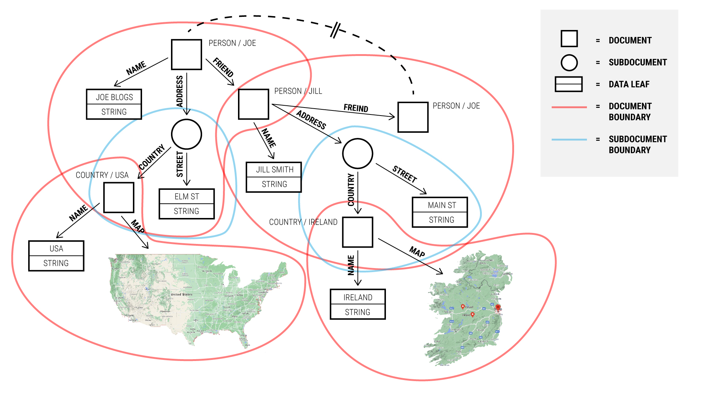

# Documents

TerminusDB is a knowledge graph database, but it is also a document
store. This is possible because TerminusDB
[schemata](../reference/SCHEME.md) describe how to interpret segments
of knowledge graphs as self-contained documents.

TerminusDB's underlying storage structure is a *labelled*, *directed*,
*edge-labelled* graph. That means that every node (both source and
target) has a distinct name, every edge has both a name and a
direction.

But segments of the graph are designated as *documents*. These
documents can then be extracted as JSON objects, giving a convenient
data-package for applications. We can update these objects by
submitting modified versions and we can delete the entire fragment of
the graph by deleting the document. However we also retain the full
graph structure allowing sophisticated search and traversal.

Documents do not have to be shallow but can instead contain
*subdocuments* as well.  A subdocument is owned by its containing
document, and is a fragment of the grahp which is only pointed to by
the containing document, although it may have any number of out-going
links to other documents or subdocuments itself.

## Simple Documents

Documents are described by creating a class definition in the
[schema](../reference/SCHEME.md). The simplest document definition
contains only properties with data elements. For instance, we might
load a row of a football roster CSV with the following structure:

```csv
name, position
George, Centre Back
Doug, Full Back
Karen, Centre Forward
```
Using the following definition:

```javascript
{ "@type" : "@context",
  "@schema" : "terminusdb://Roster/document/",
  "@base" : "terminusdb://Roster/schema#" }

{ "@type" : "Class",
  "@id" : "Player",
  "name" : "xsd:string",
  "position" : "xsd:string" }
```

This class definition describes the form of JSON documents which can
be submited or retrieved from the graph. In this case a valid JSON
document (which corresponds to a row in the above CSV) might look as
follows:

```javascript
{ "@type" : "Player",
  "@id" : "Player/George",
  "name" : "George",
  "position" : "Centre Back" }
```

Notice, this document has an `@id` field with the value
`Player/george`. This `@id` describes the address of our document. It
will be used for retrieval, update or deletion *or* as a reference
which can be used in other documents.

The fully qualified address for `Player/george` however also includes
the `@base` as a prefix. If unambiguous, for instance when referring
to it in the same collection, then we can just use
`Player/george`. However it expands completely to:
`terminusdb://Roster/document/Player/george`.

Careful attention to the `@id` field is important. We want to
understand what makes a document unique and how to refer to it. Things
with truly unique names should use this as their `@id`. Wikipedia
actually provides an excellent example of this approach (try looking
at the Wikipedia URI for your favourite celebrity for instance).

In order to assist with name choice, TerminusDB also gives us the
`@key` parameter and `@base` to class definitions which enables
TerminusDB to calculate the `@id` for you. For more details on this see the [schema](../reference/SCHEME.md) documentation.

## Documents with references

The power of the TerminusDB knowledge graph comes in being able to
refer to other documents. This is what makes it a *graph* of documents.

The roster example above could be turned into an object which refers
to each player as  follows:

```javascript
{ "@type" : "@context",
  "@schema" : "terminusdb://Roster/document/",
  "@base" : "terminusdb://Roster/schema#" }

{ "@type" : "Class",
  "@id" : "Player",
  "name" : "xsd:string",
  "position" : "xsd:string" }

{ "@type" : "Class",
  "@id" : "Roster",
  "player" : { "@type" : "Set",
               "@class" : "Player" } }
```

Our `Roster` class points to a `Set` of `Player`s. Set is a *type
family* which allows us to state that the `player` property can have
any number of `Player`s attached. It however provides no concept of
ordering or multiplicity (to get this, you should use `List` or
`Array`). A `Player` is either connected, or it is not.

A set of documents which meets the above specification and which represents
our CSV file might look as follows:

```javascript
{ "@type" : "Roster",
  "@id" : "Roster/Wolves",
  "player" : [ "Player/George", "Player/Karen", "Player/Doug" ] }

{ "@type" : "Player",
  "@id" : "Player/George",
  "name" : "George",
  "position" : "Centre Back" }

{ "@type" : "Player",
  "@id" : "Player/Doug",
  "name" : "Doug",
  "position" : "Full Back" }

{ "@type" : "Player",
  "@id" : "Player/Karen",
  "name" : "Karen",
  "position" : "Centre Forward" }
```

The `Roster` points to the various `Player` documents. When we ask for
the document `Roster/Wolves`, the document with each identifier is
returned. Each identifier can likewise be queried to get us the full
documents associated.

## Subdocuments

A subdocument is a document which can only ever be pointed to by its
containing document. It is information which is somehow internal to
the identity of some document and is not intended to be shared.

This designation also allows us to have deeply nested JSON documents
which are self-contained and can be obtained using the
[document](../reference/Document.md) interface.

An example of a subdocument might be as follows:

```javascript
{ "@type" : "@context",
  "@schema" : "terminusdb://Game/document/",
  "@base" : "terminusdb://Game/schema#" }

{ "@type" : "Class",
  "@id" : "Stats",
  "@subdocument" : [],
  "@key" : { "@type" : "Random"},
  "strength" : "xsd:integer",
  "intelligence" : "xsd:integer",
  "dexterity" : "xsd:integer",
  "charisma" : "xsd:integer",
  "wisdom" : "xsd:integer",
  "constitution" : "xsd:integer" }

{ "@type" : "Class",
  "@id" : "Player",
  "name" : "xsd:string",
  "stats" : "Stats" }
```

This schema specification gives us players, which have a subdocument
of stats. The `Stats` subdocument status is denoted with the
`@subdocument` property, and the special value `[]`. In addition it
has a `Random` key, which means that we will automatically generate
the key when not provided.

The subdocument will allow us to send and retrieve our stats along
with our player object. For example:


```javascript
{ "@type" : "Player",
  "@id" : "Player/Hieronymous",
  "stats" : { "@type" : "Stats",
              "strength" : 14,
              "intelligence" : 10,
              "dexterity" : 14,
              "charisma" : 8,
              "wisdom" : 12,
              "constitution" : 9 } }
```

It is also possible for subdocuments to point recursively to
subdocuments, or to other documents.

### Visualising the Graph

With both documents and subdocuments and references to other documents
we can have the best of both worlds: document storage and knowledge
graph. Visualising what this means, however, requires a bit of
experience.



In the diagram above we have an example which draws boundaries around
what constitutes a document and a subdocument. The schema which
corresponds with this might be something along the lines of:

```javascript
{ "@type" : "@context",
  "@schema" : "terminusdb://People/document/",
  "@base" : "terminusdb://People/schema#" }

{ "@type" : "Class",
  "@id" : "Coordinate",
  "@subdocument" : [],
  "@key" : { "@type" : "Random"},
  "lat" : "xsd:decimal",
  "long" : "xsd:decimal" }

{ "@type" : "Class",
  "@id" : "Map",
  "coordinates" : { "@type" : "List",
                    "@class" : "Coordinate" } }

{ "@type" : "Class",
  "@id" : "Country",
  "name" : "xsd:string",
  "map" : "Map" }

{ "@type" : "Class",
  "@id" : "Address",
  "@subdocument" : [],
  "@key" : { "@type" : "Random"},
  "country" : "Country",
  "street" : "xsd:string" }

{ "@type" : "Class",
  "@id" : "Person",
  "name" : "xsd:string",
  "address" : "Address",
  "friend" : "Person" }
```

With a bit of practice, designing your own knowledge graph in
TerminusDB will become second nature.
